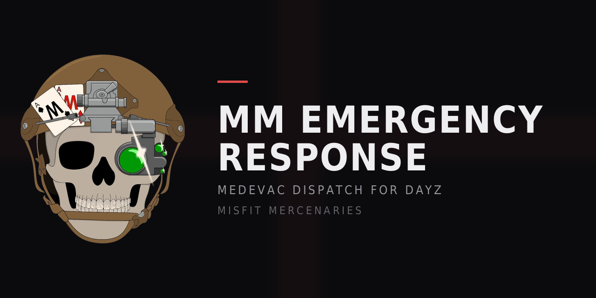

# MM Emergency Response

A DayZ MEDEVAC dispatch system. A downed player calls for help, a rostered
response team gets the call with their grid reference and live vitals, one of
them claims it, works the patient, and closes the case. Everything is yours —
no whitelist, no IP lock, no phone-home.

Written for Misfit Mercenaries (Deer Isle and Sakhal), but it has no hard
dependency on either server's mod list.

---

**Version 1.8.3.** Every line of the downed-player overlay is now rewritable in
`config.json`, with tokens for the beacon name, responder, cooldown and respawn
hold. 1.8.2 added `markerMode: 3` — a precise Expansion map marker sent to
each responder individually rather than to the whole server — and fixes the
downed-player overlay, whose text was being clipped rather than scaled. 1.8.1
made that overlay spell out all three options (wait, call, or respawn) with what
each one costs, driven by this server's real settings rather than assumed
defaults. 1.8.0 added `rosterMode`: the radio can be the licence instead of the
roster, with a need-to-know mode that lets a stranger answer a call without
handing them a map of everyone who is helpless. 1.7.4 turned the Terje Medicine
readout on against an API read from Terje's own published interfaces rather than
guessed at, and a review of 42 server runs showed zero script errors and zero
crashes since 1.5.0, with the full call lifecycle observed end to end.

Highlights since the 1.3.0 GOLD build: chat tags that work under DayZ Expansion,
optional consumable call beacons, optional responder radios with frequency
locking, an MIT licence, and the fixes from a full adversarial security audit.
See `CHANGELOG.md` and `SECURITY.md`.

---

## What it does

**Patient side**

- An overlay appears while you are unconscious with your server logo, a status
  line, and a **CALL FOR HELP** button.
- One open call per player, plus a per-player cooldown so the button can't be
  farmed.
- Once a responder claims the case, the overlay shows their name.
- The patient can cancel their own call at any time.
- Respawn is soft-locked while a responder is actually en route (configurable,
  and it lifts itself after a ceiling — nobody ever gets trapped).

**Responder side**

- `K` (configurable) opens the dispatch panel — rostered players only.
- Live queue: call id, patient, grid, state, elapsed. Colour-coded by state.
- Detail pane: grid reference and raw map metres, flat range, bearing and
  altitude difference from where you are standing, time elapsed, assigned
  responder.
- Diagnostics readout, refreshed every second while the case is open.
- Accept / Complete / Release / Re-mark actions.
- Archive view of closed cases, paged.

**Admin side**

- Roster menu inside the panel: add or remove responders by name from a list of
  online players, or paste a Steam64 directly. Writes straight to `config.json`.
- Admins themselves are edited in `config.json` only — deliberately, so nobody
  can promote themselves in-game.

**Server side**

- Call states: `NEW → IN PROGRESS → COMPLETED / PATIENT LOST / CANCELLED / EXPIRED`.
- Unclaimed calls expire on a timer; claimed ones expire on a longer one, so a
  responder who wanders off does not hold a patient indefinitely.
- A responder who disconnects mid-case returns it to the queue instead of
  leaving the patient claimed and unattended.
- Patient dies → case closes as `PATIENT LOST`, fatal sound cue to the team.
- Patient wakes up → case auto-closes.
- Pre-restart stabilisation: at T-minus N minutes, every unconscious player is
  stabilised (bleeding stopped, blood floored, shock restored) so a restart
  doesn't quietly kill people mid-intervention.
- Discord webhook on new / accepted / completed / lost / cancelled, plus the
  restart sweep. Each event is individually configurable.
- Everything persists to `$profile:MMEmergency/`.

---

## Install

1. Build the PBO — `build.bat` (edit the DayZ Tools path inside if yours
   differs). Or drop the source folder into your existing build pipeline; it is
   a plain script mod with no models or textures to bake.
2. Copy `@MMEmergencyResponse` to the server, add it to the `-mod=` line
   **after** Expansion and Terje.
3. Copy the same folder into your client mod list. This mod has client-side UI,
   so players need it too.
4. Start the server once. It writes `$profile:MMEmergency/config.json` with
   defaults, then stop it.
5. Put your Steam64 in `adminIds`, put your medics in `teamIds`, set your
   `restartTimesUTC` to match your actual restart schedule, and restart.

`$profile` is your server's profile folder — the same place `ServerProfile`,
`DayZSetup` and the crash logs live. On your CFTools deployment that is
alongside the rest of the server profile under the deployment directory.

---

## Config

`$profile:MMEmergency/config.json`. The whole file is rewritten with any new
defaults on boot, so upgrading never leaves you missing keys. If the file fails
to parse, the mod logs it, runs on defaults, and **does not overwrite your
file** — fix the JSON and restart.

Fields worth knowing about:

| Key | Default | Notes |
|---|---|---|
| `adminIds` / `teamIds` | `[]` | Steam64 strings. Admins are implicitly responders. |
| `rosterMode` | `0` | Who counts as a responder. `0` roster only, `1` anyone with a qualifying radio, `2` the same but non-roster responders see no name, position or vitals until they accept. See below. |
| `requireUnconscious` | `1` | Set `0` to let conscious players call (useful while testing). |
| `callCooldownSeconds` | `300` | Per player, starts when the call is made. |
| `callExpireMinutes` | `25` | Unclaimed calls close as `EXPIRED`. |
| `panelKeyCode` | `37` | `KeyCode.KC_K`. See the key code table below. |
| `markerMode` | `0` | `0` grid/range/bearing only (no dependencies), `2` Expansion **server** marker (global — everyone sees it), `3` Expansion **personal** marker sent to responders only. See below. |
| `marker3D` | `0` | Draw the marker in the world as well as on the map. Off — a pin floating over a downed player is visible to anyone looking that way. |
| `blockRespawnOnlyWhenClaimed` | `1` | Only lock respawn once someone is actually coming. |
| `respawnBlockMaxSeconds` | `900` | Hard ceiling on the lock. `0` or less falls back to 900 — a safety limit set to zero means the default, not "no limit". |
| `restartTimesUTC` | 4 entries | **UTC**, not local. Chicago is UTC-5 right now. |
| `stabilizeMinutesBefore` | `5` | Set `0` to disable the restart sweep entirely. |
| `discordWebhookUrl` | `""` | Full webhook URL. Empty disables all Discord posts. |
| `discordOnCancel` | `1` | Report cancelled, expired and self-healed closures too, not just the ones a responder touched. |
| `requireCallItem` | `0` | Require a beacon in the patient's inventory to call at all. Off by default — turning it on changes who can call, so an upgrade never does it silently. |
| `callItemTypes` | `["Roadflare"]` | Accepted class names. The first match found anywhere in the inventory (hands, pockets, backpack) is the one spent. |
| `callItemLabel` | `"distress beacon"` | What the refusal message calls it, e.g. "You need a distress beacon to call for help." |
| `consumeCallItem` | `1` | Spend it on a call that actually opens. `0` makes it a carry requirement instead. |
| `refundOnExpire` | `1` | Give it back if the call expires with nobody responding. |
| `refundCancelSeconds` | `30` | Give it back if the patient cancels within this many seconds. `0` disables the misclick refund. |
| `refundOnSelfRecovery` | `1` | Give it back if the patient comes round on their own before any responder took the case. Only applies while the call is unclaimed. |
| `requireItemForResponder` | `0` | Responders must carry a working radio to accept a case. Theirs is never consumed. |
| `responderItemTypes` | `["PersonalRadio"]` | What counts as a responder's radio. |
| `responderItemLabel` | `"radio"` | What the refusal messages call it. |
| `responderFrequency` | `0` | MHz the radio must be tuned to, e.g. `91.4`. `0` accepts any frequency. |
| `responderRadioMustBeOn` | `1` | The radio must be switched on **and** have a live battery. |
| `chatTagEnabled` | `1` | Draw a tag next to responders' names in chat. `0` turns it off entirely. |
| `chatTagText` | `"[MEDEVAC]"` | The tag for rostered responders. |
| `chatTagColor` | `"0xFF4BE07A"` | ARGB, `0x` or `#`, 6 or 8 digits. |
| `chatTagAdminText` | `"[MEDEVAC CMD]"` | The tag for admins, who are responders too. |
| `chatTagAdminColor` | `"0xFFE0A94B"` | As above. |
| `archiveMaxEntries` | `500` | `0` or less falls back to 500 — the archive is rewritten on every closure, so unbounded means an ever-growing write. |
| `diagnostics` | see below | Drives the readout rows. |

### Checking a gate is actually on

Both item gates ship **off**. On boot the server states what is live:

```
[MMER][INFO]  Patient beacon gate: OFF
[MMER][INFO]  Responder radio gate: ON (PersonalRadio, 91.9 MHz, must be powered on)
[MMER][INFO]  Chat tags: ON ([MEDEVAC] / [MEDEVAC CMD])
```

Read those three lines in `emergency.log` before concluding anything is broken —
a key sitting at `0` and a real bug look identical from in-game.

### Call beacons

With `requireCallItem` on, a patient needs one of `callItemTypes` in their
inventory to call, and it is spent when the call opens. The order matters: the
check runs *before* the call is created and the item is taken *after*, so a
refusal further down can never cost someone a beacon for nothing.

It comes back in two cases — the call expired with nobody answering, and the
patient cancelled inside `refundCancelSeconds`. Both exist because the worst
outcome this system can produce is a player burning a scarce item and getting no
rescue, and because a misclick should never cost anything. It does **not** come
back on a completed case (it did its job) or on death (they lost everything
anyway). A refund goes to the inventory, or to the ground at their feet if they
are full, so it cannot silently evaporate.

`Roadflare` is the seeded default because it exists in vanilla and reads as a
signal. Point `callItemTypes` at your own item whenever you have one — it is a
list, so you can accept several.

**On consuming:** a genuinely stackable item (one with `canBeSplit` in its
config, like ammo) loses exactly one unit. Anything else is removed whole. That
distinction matters because DayZ uses `quantity` for two different things — a
count on a stack, but a resource on many items, where a Roadflare's quantity is
its remaining burn time and a canteen's is millilitres. Consuming "one" of a
flare has to mean the flare, not one second of it.

### Responder radios

`requireItemForResponder` makes the medics carry kit too. Unlike the patient's
beacon it is never consumed — they pay in inventory space and upkeep, the
patient pays in stock.

Setting `responderFrequency` to a real value (say `91.4`) means a medic must
have their radio tuned there to accept a case. This works on the responder side
precisely because it would not work on the patient's: a responder is conscious,
can retune in seconds, and is someone you can simply tell the frequency to in
Discord. An unconscious player can do none of those things.

Every refusal names the actual problem — no radio, radio off or flat, or tuned
to the wrong frequency **with both frequencies printed**. A mechanic like this
is demanding when the player can see what's wrong and broken when they can't.

`responderRadioMustBeOn` checks that the radio is genuinely working, not just
switched on: a radio flicked on with a dead battery is off as far as anyone
using it is concerned. Carrying several radios is fine — if any one of them
qualifies, the medic is through.

### What the downed player sees

The unconscious overlay is the only part of this mod most of your players will
ever meet, and for a long time it showed a title, a status line and a button —
which reads as "a button that might do something". It now lays out the three
options explicitly, and rewrites them as the situation changes:

| Situation | What it says |
|---|---|
| Down, able to call | Wait, call (naming the cost), or respawn — plus that the beacon comes back if you come round first |
| Call out, unclaimed | Nobody has taken it yet, the self-recovery refund, and that you can still respawn or cancel |
| Responder en route | Who has the case, that respawn is held and roughly how long for, and that cancelling is still there |
| On cooldown | The same three options, with the remaining time in place of the cost |

Every line is built from the server's own settings rather than assumed. If
`consumeCallItem` is `0` nothing is spent, so no refund line appears; if
`refundOnSelfRecovery` is `0` the overlay does not claim one. The alternative is
copy that promises something your server does not do, which costs more trust
than saying nothing.

The layout carries four optional text widgets (`mmer_opt1`, `mmer_opt2`,
`mmer_opt3`, `mmer_hint`). They are null-checked, so an old layout against new
scripts still gets a working button.

### Rewording the overlay

Every line on the downed-player panel is a key in `overlayText` in
`config.json`. **An empty string means "use the built-in"** — which is why an
existing config, which has none of these keys, behaves exactly as it did before,
and why you can override one line without inheriting the other twenty-seven.

Six tokens are substituted at display time:

| Token | Becomes |
|---|---|
| `{beacon}` | `callItemLabel`, e.g. "distress beacon" |
| `{medic}` | the responder's name, or "A responder" before one is assigned |
| `{cooldown}` | time left on the call cooldown, e.g. "4m 12s" |
| `{hold}` | how long respawn stays held, e.g. "15 min" |
| `{cancel}` | the quick-cancel refund window, e.g. "30s" |
| `{team}` | `teamName`, e.g. "MEDEVAC" |

An unknown token is left on screen as typed rather than blanked, so `{beacn}`
announces itself instead of silently eating a word.

| Key | Built-in |
|---|---|
| `title` | YOU ARE UNCONSCIOUS |
| `titleCallActive` | EMERGENCY CALL ACTIVE |
| `statusDown` | You cannot move or speak until you come round. |
| `statusQueued` | Call sent. The response team has been notified. |
| `statusEnroute` | Responder en route: {medic} |
| `statusCooldown` | You can call again in {cooldown} |
| `statusUnavailable` | You cannot call for help right now. |
| `btnCall` | CALL FOR HELP |
| `btnCancel` | CANCEL CALL |
| `btnCooldown` | ON COOLDOWN |
| `idle1` | 1.  WAIT - you may come round on your own. |
| `idle2Cost` | 2.  CALL FOR HELP - costs one {beacon}. |
| `idle2Free` | 2.  CALL FOR HELP - a responder comes to you. |
| `idle2Cooldown` | 2.  CALL FOR HELP - on cooldown for {cooldown}. |
| `idle2Unavailable` | 2.  CALL FOR HELP - not available right now. |
| `idle3` | 3.  RESPAWN - Esc > Respawn. You lose your gear. |
| `idleHintRefund` | Wake up first and your {beacon} is returned. |
| `idleHint` | Calling sends your location to the response team. |
| `queued1` | Your call is out. Nobody has taken it yet. |
| `queued2Refund` | Wake up first and your {beacon} comes back. |
| `queued2` | Sit tight - a responder may still pick it up. |
| `queued3` | You can respawn or cancel at any time. |
| `queuedHint` | Cancel within {cancel} to keep your {beacon}. |
| `enroute1` | {medic} has your case and is on the way. |
| `enroute2Held` | Respawn is held for up to {hold} while they come. |
| `enroute2Free` | You can still respawn if you want to. |
| `enroute3` | Cancel below if you would rather not wait. |
| `enrouteHint` | Your {beacon} is spent - a responder answered it. |

Which variant is shown is still decided by the server's real settings, not by
which keys you filled in. `idle2Cost` only appears when a beacon is genuinely
required *and* consumed; the refund lines only appear when a refund actually
happens. Writing a refund line on a server that does not refund does not make
one appear, which is the point.

**On text fitting.** DayZ text clips rather than shrinking, so these widgets pin
a size with `"exact text"` / `"exact text size"`, wrap via
`MultilineTextWidgetClass`, and are measured at runtime by `FitText()`, which
steps the size down until the rendered text fits the widget in both directions.
If you edit the copy or change `callItemLabel` to something long, it will shrink
rather than cut off — but keep lines under about 55 characters and it will never
need to.

### Map markers

`markerMode: 0` is the default and needs nothing: the panel's grid reference,
range, bearing and altitude difference are the whole locate mechanism.

If you run DayZ Expansion there are two marker modes, and the difference between
them matters more than it sounds:

| Mode | Who sees the patient's position |
|---|---|
| `2` | **Everyone on the server.** Expansion server markers are global. |
| `3` | **Only current responders**, one personal marker each. |

Mode 2 turns a MEDEVAC call into a public announcement that somebody is lying
helpless at a known grid. On a PvE or RP server that may be exactly what you
want. On a PvP server it is a raid feed, and it is the same disclosure
`rosterMode: 2` exists to prevent — so the boot log reports it as a **warning**,
not an info line.

Mode 3 sends a personal Expansion marker to each responder individually, using
the same pattern Expansion uses for its own death marker. It is placed when the
call opens, refreshed on re-mark, and cleared when the case closes. Two rules
it follows:

- **A redacted viewer never gets one** under `rosterMode: 2` unless they have
  accepted the case. A marker *is* the position.
- **The clear goes to everyone online**, not just current responders. Somebody
  who stowed their radio still has the pin, and a stale marker pointing at a
  closed case is worse than a redundant packet.

Markers are deliberately non-persistent. Expansion defaults personal markers to
persistent, which would bring a pin back on every login for a case that ended
hours ago.

Both modes need the `MMER_EXPANSION` build flag and
`DayZExpansion_Navigation_Scripts` in `requiredAddons[]`. Without the flag the
mod logs the refusal at boot and runs mode 0.

### Roster mode — who counts as a responder

The obvious feature request for a medic system is "drop the whitelist, anyone
with the radio is an EMT." Before turning it on, the thing worth being clear
about:

> **The roster is not only who may *accept*. It is who may *see*.** The dispatch
> panel carries every open call's patient name, grid reference and live vitals.
> An unrestricted queue on a PvP server is a live feed of who is helpless and
> exactly where — a raid tool wearing a medic's coat.

So there are three modes rather than a switch.

**`rosterMode: 0` — roster only.** `adminIds` + `teamIds`. The default, and what
every version before 1.8.0 did.

**`rosterMode: 1` — open.** Anyone carrying a qualifying radio is a responder,
full panel. Right for PvE and heavily RP servers where the queue being public is
the point.

**`rosterMode: 2` — open, need-to-know.** Anyone carrying a qualifying radio is a
responder, but one who is not on the roster sees the call exists and nothing
else: no patient name, no grid, no range or bearing, no vitals, and a redacted
version of the incoming-call popup. **Accepting the case reveals all of it** —
and writes their name to the call, the log and Discord.

That last mode is the one to run on a PvP server. It keeps the thing that makes
open enrolment good — a stranger with a radio can answer a call at 3am when no
rostered medic is online — while making the information cost something. You can
still accept a case purely to read the grid and then release it; the deterrent
is that your name is on it, not that it's impossible. If you need it to be
impossible, use mode 0.

**The radio is the same radio.** Modes 1 and 2 qualify on `responderItemTypes`,
`responderFrequency` and `responderRadioMustBeOn` — the settings
`requireItemForResponder` already uses. Tune the gate once; carry one radio.

**An open mode with an empty `responderItemTypes` is refused at boot** and falls
back to roster only, with a warning. An empty list means "nothing was asked
for", which in an open mode would qualify every player on the server.

**Membership is transient, and pushed.** Pick up a radio and the server notices
on the next sync interval, pushes you a new role, opens your panel and toasts
you. Stow it and the reverse. This sweep walks inventories, so it runs on the
sync interval rather than every tick — and not at all in mode 0.

**Chat tags stay roster-only in every mode.** A tag that followed the radio would
flicker as people stow and draw, and would turn a recognition marker into a live
"who has the panel open right now" broadcast. The tag means the server vouches
for this person. The queue means who can help today. Those are different
statements and they should stay different.

### Chat tags and Expansion

**`MMER_EXPANSION_CHAT` is on in the shipped build**, because Expansion Chat
replaces the chat renderer wholesale — it draws its own line and never
instantiates vanilla's `ChatLine`, so the vanilla hook alone silently does
nothing and no tag appears. The flag lives in
`Scripts/5_Mission/MMER_00_MissionDefines.c` and is paired with
`"DayZExpansion_Chat_Scripts"` in `requiredAddons[]`. On Expansion the tag fills
Expansion's own `PlayerTag` slot, so the tag and the name share one colour.

Turn the flag off and remove that addon if you do not run Expansion — with it on
and Expansion absent, the build fails to compile, deliberately.

### A note on the chat tag

The tag is drawn by the client next to the sender's name, and it is cosmetic:
it confers nothing and is checked nowhere. DayZ chat carries a display name and
no Steam64, so a player who renames themselves to match a responder gets the
tag too. Nothing in this mod trusts a name for anything, so that is a cosmetic
impersonation and not an access path — but if it bothers you, set
`chatTagEnabled: 0`.

Common `panelKeyCode` values: `K` 37, `J` 36, `H` 35, `N` 49, `M` 50,
`F5` 63, `F6` 64, `Insert` 210, `End` 207.

### Diagnostics rows

The readout is data-driven. Each row is:

```json
{ "id": "terje:sepsis", "label": "Sepsis", "unit": "", "scale": 1.0,
  "decimals": 2, "warnAbove": 0.01, "warnBelow": -1 }
```

- `vanilla:` ids always resolve: `blood`, `health`, `shock`, `bleeding`,
  `energy`, `water`, `temperature`, `unconscious`, `alive`.
- `terje:` ids are friendly names the adapter translates to Terje's own record
  ids. Conditions: `sepsis`, `pain`, `influenza`, `zvirus`, `poison`,
  `biohazard`, `rabies`, `overdose`, `contusion`, `viscera`, `mind`,
  `sleeping`. Wounds: `hematoma`, `bulletHit`, `stabWound`, `bandagesClean`,
  `bandagesDirty`, `suturesClean`, `suturesDirty`. Treatments on board:
  `painkiller`, `antibiotics`, `antisepsis`, `antipoison`, `antibiohazard`,
  `rabiesCure`, `zAntidot`, `hemostatic`, `bloodRegen`, `salve`, `adrenalin`,
  `disinfected`. Plus `radiation`, which comes from TerjeRadiation rather than
  Terje Medicine and reads 0 without it. A raw Terje record id (anything
  starting `tm.`) passes straight through, so you are not limited to the list.
- `warnAbove` / `warnBelow` turn the value amber; `-1` disables that side.
- An id that doesn't resolve shows `--` in grey rather than vanishing, so a
  typo is visible instead of silent.

Reorder, relabel, add and remove rows freely — it's JSON, not script.

---

## Optional integrations

> **The shipped build is not dependency-free.** `MMER_TERJE` and
> `MMER_EXPANSION_CHAT` are both on, so it requires Terje Core + Terje Medicine
> and DayZ Expansion (Chat). Building from this source with the flags off, and
> `requiredAddons[]` trimmed back to `{"DZ_Data", "DZ_Scripts"}`, gives you a
> mod with no dependencies at all — the `terje:` rows then read `--` and the
> chat tag falls back to vanilla chat.

Each flag is paired with its addons, and the pairing is the whole contract: a
flag on without its addons fails at build time with "unknown type", which is the
loud failure the flags exist to produce.

| Flag | Defined in | Addons |
|---|---|---|
| `MMER_TERJE` | `Scripts/4_World/MMER_00_Defines.c` | `TerjeCore`, `TerjeMedicine` |
| `MMER_EXPANSION_CHAT` | `Scripts/5_Mission/MMER_00_MissionDefines.c` | `DayZExpansion_Chat_Scripts` |
| `MMER_EXPANSION` (off) | `Scripts/4_World/MMER_00_Defines.c` | `DayZExpansion_Core` |

### Terje Medicine — `MMER_TERJE`

All Terje contact is in one file, `MMER_TerjeAdapter.c`, and it depends on
exactly three facts from
[TerjeBruoygard/TerjeModsScripting](https://github.com/TerjeBruoygard/TerjeModsScripting):

1. `PlayerBase.GetTerjeStats()` returns a `TerjePlayerStats` — and returns it
   only on a dedicated server or for the locally controlled player. This mod
   only ever calls it server-side, which is the case that always resolves.
2. `TerjePlayerStats` has **no** generic float accessor. Its readings are named
   records on `TerjePlayerRecordsBase`, read with `TryGetIntValue` /
   `TryGetFloatValue` / `TryGetBoolValue`, each of which returns `false` for an
   id that was never registered. That `false` is precisely the "unavailable"
   signal the panel wants, so an unknown or disabled reading degrades to `--`
   instead of to a plausible-looking `0`.
3. Radiation is not a Medicine record. It comes from
   `PlayerBase.GetTerjeRadiation()`, which Terje Core declares and
   TerjeRadiation implements; without TerjeRadiation it returns 0.

`MMER_TerjeAdapter.MapId()` holds the friendly-name-to-record-id table, so
adding a reading is one line there — or zero, if you put the raw `tm.` id
straight into `config.json`.

`MMER_TerjeAdapter.Stabilize()` is where anything Terje-specific belongs in the
pre-restart sweep. It does nothing by default, on purpose: the sweep exists to
stop people bleeding out through a restart, not to hand out free treatment, and
silently curing sepsis would undo a responder's work. The real setters are
written out commented if you disagree.

### Expansion markers — `MMER_EXPANSION`

**Not needed for the default setup.** `markerMode: 0` ships as the default:
no pin anywhere, the responder navigates from the grid reference, range,
bearing and altitude difference in the panel. Nothing to verify, nothing to
depend on, and it fits a hard-progression server better than a waypoint does.

If you later want an actual pin, contact is confined to
`MMER_MarkerAdapter.PlaceExpansion()` / `RemoveExpansion()` — verify
`CreateServerMarker` / `RemoveServerMarker` against your installed
`DayZ-Expansion-Core`. Be aware that Expansion **server** markers are global:
every player on the server sees them, not just responders. If the adapter can't
resolve the module at runtime it logs a warning and falls back to mode 0 rather
than throwing.

---

## What to check on first compile

I wrote this without a Workbench to compile against, so a handful of engine
call sites are worth eyeballing on your first build. All of them are isolated
and commented in place.

**Layouts.** The five `.layout` files under `GUI/layouts/` are the part I'd
expect to need the most attention — hand-written Enfusion layout markup is
fiddly and mine hasn't been through the GUI Editor. Open each in Workbench's GUI
Editor and re-save; that normalises the markup. The script only ever looks up
widgets by name, so as long as these names exist, the visual layout is yours to
arrange however you like:

| Layout | Required widget names |
|---|---|
| `mmer_call_button` | `mmer_panel`, `mmer_call_btn` (ButtonWidget), `mmer_call_label`, `mmer_status`, `mmer_logo` |
| `mmer_panel` | `mmer_title`, `mmer_subtitle`, `mmer_list`, `mmer_empty`, `mmer_d_name`, `mmer_d_state`, `mmer_d_grid`, `mmer_d_range`, `mmer_d_elapsed`, `mmer_d_medic`, `mmer_d_note`, `mmer_diag_list`, `mmer_btn_accept`, `mmer_btn_complete`, `mmer_btn_abandon`, `mmer_btn_mark`, `mmer_btn_archive`, `mmer_btn_archive_label`, `mmer_btn_admin`, `mmer_btn_close` |
| `mmer_call_row` | `mmer_row_stripe`, `mmer_row_id`, `mmer_row_name`, `mmer_row_grid`, `mmer_row_state`, `mmer_row_age` |
| `mmer_diag_row` | `mmer_diag_label`, `mmer_diag_value` |
| `mmer_roster_row` | `mmer_roster_name`, `mmer_roster_uid`, `mmer_roster_action`, `mmer_roster_action_label` |
| `mmer_admin` | `mmer_member_list`, `mmer_online_list`, `mmer_uid_input`, `mmer_btn_add`, `mmer_btn_admin_close`, `mmer_admin_hint` |

Every layout load is null-checked and logs a specific error, so a bad layout
degrades to "the button doesn't appear" rather than a script crash.

**Engine calls — verified against the 1.24 script dump:**

`CGame.RPCSingleParam` · `CGame.GetPlayers` · `ManBase.GetBleedingBits` ·
`ManBase.GetBleedingManagerServer` · `BleedingSourcesManagerBase.RemoveAllSources` ·
`Mission.OnKeyPress` · `Mission.CreateScriptedMenu` · `Mission.OnMissionFinish` ·
`MissionServer.InvokeOnConnect` / `InvokeOnDisconnect` · `RestContext.SetHeader`
(singular, one full header line) · `RestContext` must NOT be held as a `ref`
(private destructor) · `RestCallback` extends `Managed`, so it may be.

`ChatMessageEventParams` is `Param4<int,string,string,string>` (channel, from,
text, colour class) · `SEffectManager.PlaySound(string, vector, ...)` returns
`EffectSound` · `EffectSound.SetSoundVolume` / `SetAutodestroy` ·
`UIManager.EnterScriptedMenu` / `ShowUICursor` / `GetMenu` / `IsDialogVisible` ·
`Input.ChangeGameFocus(int, int=-1)` / `ResetGameFocus(int=-1)` /
`LocalPress(string, bool=true)` · `Widget.Enable` / `SetAlpha` / `SetColor` /
`GetSize` / `GetSibling` / `GetChildren` / `FindAnyWidget` / `SetHandler` ·
`ImageWidget.LoadImageFile(int, string, bool=false)` · `EditBoxWidget.GetText()` ·
`InGameMenu`'s respawn buttons are `respawn_button`, `respawn_button_random`
and `respawn_button_custom` — all three must be locked.

**A caution about the reference itself:** the public script dumps are 1.24; the
server runs 1.29. Most of the surface is stable, but not all of it —
`TranslateString` exists in the 1.24 dump and does **not** exist on 1.29. Treat
the dump as strong evidence, not proof.

**Enforce parser gotchas worth remembering** (all bitten and fixed here):

- `out` is a reserved word. Never name a local `out` — the error appears on the
  *following* line as "broken expression".
- Stacked backslash escapes (an escaped backslash followed by an escaped quote)
  break the string lexer, and it then consumes the rest of the file. Build JSON
  with `JsonSerializer`, not by hand.
- Allocating `ref` members inline in a class body is unreliable — do it in the
  constructor.
- `ref` on an engine type with a private destructor fails to compile
  (`RestContext`, `RestApi`). You borrow those, you don't own them.
- `array<ref T>` and `array<T>` are **unrelated types**. `Copy()` on a ref array
  will not take another ref array. Loop and `Insert()` instead.
- Class references are tested for truthiness (`if (obj)`), not compared against
  `null` with `==` / `!=`.
- `UIScriptedMenu` derives from `Managed`, **not** `ScriptedWidgetEventHandler`.
  Never call `layoutRoot.SetHandler(this)` from a menu — just override
  `OnClick`; the engine routes the menu's own widgets to it.
- `PlayerIdentity` is server-side. `GetGame().GetPlayer().GetIdentity()` is
  routinely null on the client, so a client can't read its own Steam64 — the
  server has to send it.
- A missing global referenced from inside a class is reported as an undefined
  **method on that class** (`MyClass.SomeGlobal`), which sends you looking in
  the wrong place. The symbol doesn't exist; it isn't a scoping problem.
- Stringtable `#KEY` lookup only happens when the key is the entire string.
  Interpolated text can't be localised — make it a literal.
- A condition cannot be continued onto a line that **starts with an operator**
  (`&& ...`). Multi-line *call arguments* are fine; multi-line *conditions* are
  not. Break the condition into named locals instead.
- Reserved-word collisions and stacked escapes both report on the *next* line,
  and a lexer failure blames a random vanilla file. Trust the module + filename
  in the message, not the line number in front of it.

---

## Test pass

Do this on DeerIsleDev before it goes near live:

1. Set `requireUnconscious: 0` temporarily. Confirm the button appears and a
   call lands in the panel.
2. Set it back to `1`. Knock yourself out, confirm the overlay appears over the
   unconscious vignette and the cursor works.
3. Second account on the roster: accept the call, check the grid/range/bearing
   readout actually points at the patient.
4. Kill the patient — confirm the case closes as `PATIENT LOST` and the team
   gets the fatal cue.
5. Revive path: wake the patient up, confirm auto-close.
6. Disconnect the responder mid-case, confirm the call returns to the queue.
7. Set `restartTimesUTC` to two minutes out with `stabilizeMinutesBefore: 1`,
   go unconscious, confirm the sweep wakes you.
8. Check `$profile:MMEmergency/emergency.log` and `archive.json` have the
   history.
9. Restart the server with an open call — confirm it comes back `EXPIRED`
   rather than pointing at a stale position.

---

## Design notes

**The server owns everything.** The client holds a read-only projection. Every
button sends a request; nothing changes until the server pushes new state back.
Requests are authenticated from the RPC sender identity, and an RPC that arrives
on a player entity other than the sender's own is dropped — so a modified client
can't act on someone else's behalf.

**No Community Framework dependency.** Traffic rides the vanilla per-entity RPC
channel with JSON string payloads. Easy to log, easy to diff, one less mod in
the chain.

**Nothing traps a player.** Every path out is covered, and each one is there
because the failure mode without it is somebody stuck staring at a disabled
button. The respawn lock has a ceiling that cannot be configured away. Calls
expire — unclaimed ones on `callExpireMinutes`, claimed ones on twice that, so
a responder who wanders off does not hold a patient forever. Disconnected and
de-rostered responders release their cases. Open calls close on boot. Every
closure pushes fresh state to the patient, and the respawn screen asks the
server for state each time it opens, so a stale flag cannot survive.

**Player names are attacker-controlled, and the client is assumed hostile.**
Names are stripped of markdown, mention and control characters and clamped
before they reach the Discord webhook body or the log file, and the webhook
payload sets `allowed_mentions` so Discord resolves no mentions regardless.
Steam64s from the admin menu must be exactly 17 digits starting with 7 before
they are written to `config.json`. Inbound RPCs are size-capped and rate-limited
per player before they are parsed, let alone acted on. `SECURITY.md` has the
full threat model and the audit history.

---

## Licensing

MIT — see `LICENSE`. Use it, modify it, ship it in your own server pack;
just keep the copyright notice.

Every line here is original work, written from scratch against the DayZ
Enforce Script API and the vanilla 1.29 game scripts. No third-party mod was
decompiled, unpacked, or borrowed from at any point. A dispatch system for
downed players is a general idea, and that is all this shares with anything
else in the genre.
